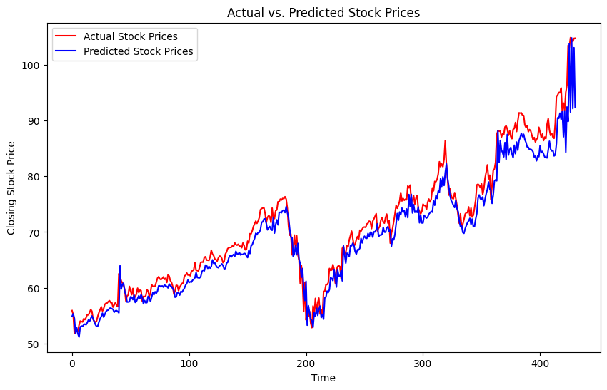
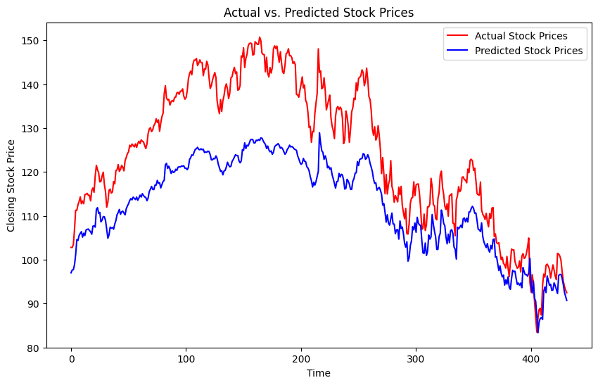

# RNN Stock Price Prediction

This repository contains the code and the pdf report for predicting stock price using recurrent neural networks. Various different architectures are explored.

[Stock Market Data](https://www.kaggle.com/datasets/paultimothymooney/stock-market-data) dataset from Kaggle.

*Figure 1: GRU model with attention mechanism performance on validation set*

*Figure 2: GRU model with attention mechanism performance on test set*
